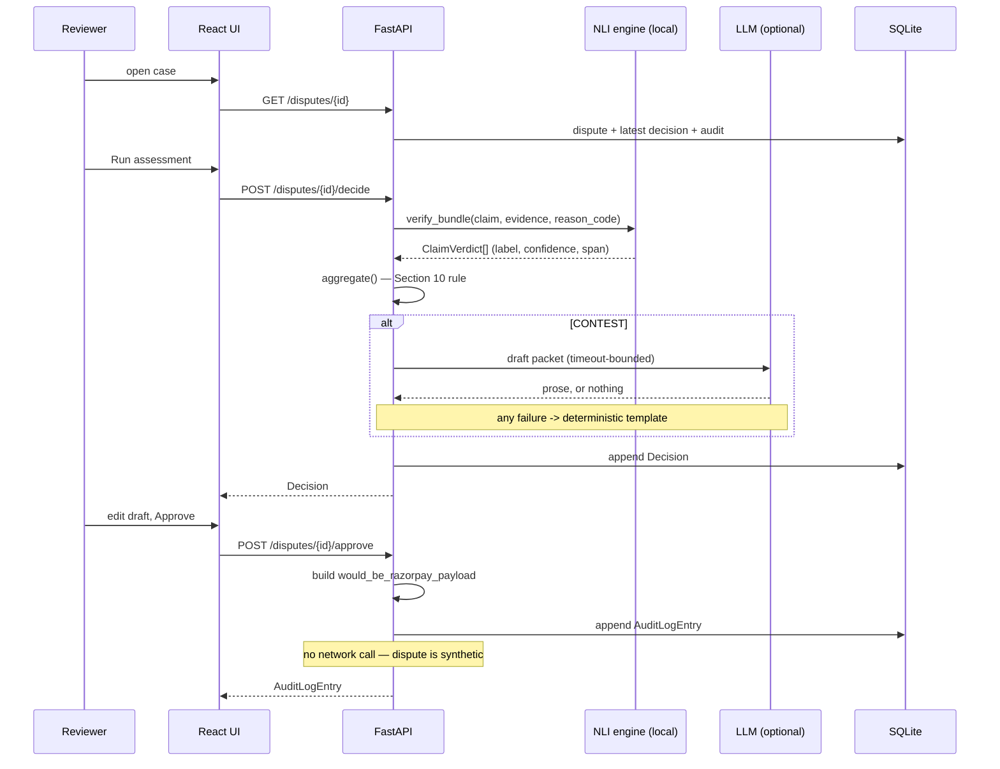

# Architecture

How Recourse is put together, and — more usefully — what didn't work and what the numbers
said. Every figure here was measured on this repo, not estimated.

---

## Contents

- [Request flow](#request-flow)
- [The two-signal verification engine](#the-two-signal-verification-engine)
- [Decision aggregation](#decision-aggregation)
- [The real-vs-synthetic boundary](#the-real-vs-synthetic-boundary)
- [Representment drafting](#representment-drafting)
- [Data and the held-out split](#data-and-the-held-out-split)
- [What broke, and what fixed it](#what-broke-and-what-fixed-it)
- [Where the safety constraints actually live](#where-the-safety-constraints-actually-live)

---

## Request flow



---

## The two-signal verification engine

`backend/app/services/verification_engine.py`

### The obvious design, and why it fails

The natural approach is to score each evidence item against the bank's claim with an NLI
model and map the labels through. Measured on the working set under the aggregation rule:

| | Naive (evidence vs claim) |
|---|---|
| Precision | **0.481** |
| Recall | 0.765 |
| Coverage | 0.423 |
| FP cost | ₹42,000 |

Precision below 0.5 is not "weak" — it is **inverted**. CONTEST fired on `contest_loss`
records 40% of the time versus `contest_win` 35%. Shipping that loses merchants money on
balance.

Two things were wrong, and neither is a tuning problem:

1. **Entailment cannot see evidentiary strength.** A gold-standard delivery proof and a
   bare "marked delivered" scan *both* contradict "the merchandise never arrived". The
   model correctly reports contradiction for both, because both do contradict it. The thing
   that separates a winning case from a losing one — how *specific* the proof is — is
   invisible to that question.
2. **Confidence carried no information.** 82% of verdicts came back at ~1.00, so the
   aggregation rule's `> 0.7` and `> 0.65` gates never bound on anything.

### The fix

Each evidence item is scored on two axes with the same cross-encoder:

| Signal | Question | Behaviour |
|---|---|---|
| **Engagement** | `NLI(evidence, bank's claim)` → contradiction. Does this evidence address the accusation at all? | Saturated. Nearly anything on-topic scores high. Weak discriminator, but a necessary gate. |
| **Substantiation** | `NLI(sentence, reason-code probe)` → max entailment. Is this evidence *specific enough* to prove the merchant's position? | Genuinely discriminative and bimodal. |

The probe is a short declarative per reason code — `"The customer received the goods."`,
`"The refund was paid to the customer."` A bare delivery scan engages the claim but does
not entail that the customer received anything; a signature plus OTP plus a matching name
does.

`confidence` is an equal-weight blend of the two. This is the load-bearing part: because
confidence now carries evidentiary strength, the aggregation rule's `avg > 0.65` gate does
real work, and its `min()` rule genuinely means "the weakest thing the merchant is relying
on" rather than being decorative.

| | Naive | Two-signal |
|---|---|---|
| Precision | 0.481 | **0.625** |
| Recall | 0.765 | 0.556 |
| Coverage | 0.423 | 0.214 |
| FP cost | ₹42,000 | **₹9,000** |

Direction is now correct and monotonic: CONTEST fires on `contest_win` 14% > `contest_loss`
9% > `should_accept` 2%.

### Things that were tried and rejected

| Approach | Result | Why rejected |
|---|---|---|
| Sentence-level max contradiction vs claim | separation **−17.1%** | Made it worse — more chances to find a spurious contradiction. |
| Long, specification-style probes | entailment ≈ 0 everywhere | SNLI/MNLI hypotheses are short declaratives; long ones score nothing. |
| Require every item to substantiate | coverage 13%, 1 CONTEST total | Real bundles pair one decisive item with context that legitimately substantiates ~0. |
| `SUPPORT_FLOOR = 0.50` | recall 0.556 → 0.333 | Downgraded contextual evidence to neutral; since the rule needs *all* verdicts to be `support`, each downgrade killed a whole bundle. |
| Substantiation cutoff at 0.005 | precision **0.800** | Tempting, but only 5 auto-CONTESTs across 182 records — ≈2 held-out. Precision from 2 samples is noise, not a result. |

The last row is worth dwelling on: it produces the best-looking number in this document and
was rejected precisely because it would not survive contact with the held-out set.

### Explainability

`highlighted_span` is the sentence with the highest substantiation score — i.e. the line
that actually proves something. It is copied verbatim from the evidence, so the UI renders
it as an exact inline `<mark>` rather than an approximate match.

### The label inversion

The NLI hypothesis is the **bank's claim**, so labels invert on the way into a verdict:

| NLI label | Meaning | ClaimVerdict |
|---|---|---|
| contradiction | evidence refutes the bank | `support` |
| entailment | evidence confirms the bank | `contradict` |
| neutral | unresolved | `neutral` |

Getting this backwards would invert every recommendation in the system while still
producing plausible confidence scores and passing every other test. It is pinned by
`test_label_inversion_is_not_reversed`, and the model's own `id2label` order is re-checked
at load rather than trusted.

---

## Decision aggregation

`backend/app/services/decision_aggregator.py` — a plain conditional, deliberately not a
learned model. A merchant needs to read why the system said what it said.

```
if any verdict is `contradict` with confidence > 0.7      -> ACCEPT
elif all verdicts are `support`
     and average(confidence) > 0.65
     and >= 2 distinct evidence types among them          -> CONTEST
else                                                      -> NEEDS_HUMAN_REVIEW

overall_confidence = min(confidence over the verdicts that DROVE the decision)
```

Two details that are easy to get wrong and are pinned by tests:

- The thresholds are **strict** inequalities. Exactly 0.7 must not trigger ACCEPT; exactly
  0.65 must not trigger CONTEST.
- The `min()` is over the verdicts that *drove* the decision, not all of them — a
  low-confidence verdict that didn't participate must not drag the reported number down.

`AggregationResult.rationale` names the specific condition that failed ("support rests on
only 1 evidence type"), so the UI and audit trail explain outcomes without re-deriving the
rule.

---

## The real-vs-synthetic boundary

| Real | Synthetic |
|---|---|
| Razorpay orders (`order.create`) | `dispute_id`, `phase`, `reason_code` |
| Payments completed via Checkout | `claim_text`, `evidence_bundle` |
| Payment links | `ground_truth_label` |

Razorpay has no API to fabricate either a chargeback *or* a payment — both were verified
against the live API, not assumed. `POST /v1/payments/create/json` and `.../create/upi`
both return 404 on a standard test account; server-side card payments require per-account
PCI-DSS enablement. So payments come from a real Checkout interaction, and disputes are
generated.

**Consequence for `/approve`:** approving a CONTEST builds the exact contest payload,
stores it in `would_be_razorpay_payload`, sets `submitted_to_razorpay = True`, and makes no
network call. The flag means *"prepared and logged as if submitted"*, never *"sent"*.

This is enforced in two independent layers:

1. `routes.approve()` never invokes the client for a synthetic dispute.
2. `razorpay_client._dispute_call()` — the single choke point for every dispute-side
   operation — inspects the id first and refuses. There is deliberately no override flag.

`test_razorpay_client.py` substitutes an SDK stub that **raises on any attribute access**,
so a regression fails loudly rather than quietly reaching the network. A companion test
confirms the guard is narrow enough that a genuine dispute id still sends.

---

## Representment drafting

`packet_generator.py` (template) + `packet_llm.py` (providers)

```
CONTEST decision
      │
      ├─ build deterministic template from supporting verdicts + spans
      │
      └─ if a provider is configured:  Gemini → Anthropic
             ├─ success + keeps source refs  → use it
             ├─ dropped every source ref     → discard, use template
             ├─ error / timeout / empty      → use template
             └─ no key                       → template
```

The template is a **supported path, not a degraded one**. It is built from the engine's own
findings — it cites each supporting item, quotes the span that drove the verdict, and
reports the weakest-link confidence — so it is grounded even without an LLM. A demo that
needs a network round-trip to produce its main artefact is a demo that can fail live.

An LLM draft that drops every `source_ref` is rejected: fluent prose citing nothing is
worse than a plain document citing evidence.

The model id is **discovered at runtime**, not pinned. See below for why.

---

## Data and the held-out split

261 records → stratified 70/30 → 182 working / 79 held-out.

- **Stratified, not random.** An unstratified 30% of ~260 records can skew label balance by
  several points, moving reported precision for reasons unrelated to model quality.
  Achieved: working 40.7/31.9/27.5 vs held-out 40.5/31.6/27.8.
- **The held-out set is never seeded into the database.** `/evaluate` reads the file
  directly. Keeping it out of the queue is a structural guarantee against leakage rather
  than a convention, asserted by `test_held_out_records_are_never_seeded`.
- **Timestamps are rebased at seed time.** The committed dataset has absolute dates; without
  rebasing, a clone made weeks later shows an entirely overdue queue. The whole set shifts
  by one offset, preserving the original urgency spread.

---

## What broke, and what fixed it

| Failure | How it surfaced | Fix |
|---|---|---|
| Verification precision 0.481, **inverted** | Measured the naive engine before building on it | Two-signal design → 0.625 |
| `RuntimeError: Already borrowed` under concurrent `/decide` | Batch-assessing from the queue; two tabs would have done it | HuggingFace's fast tokenizer is a Rust object that panics on concurrent entry, and FastAPI runs sync endpoints in a threadpool. Serialised inference behind a dedicated lock |
| `razorpay` 1.4.2 cannot import on Python 3.12+ | `ModuleNotFoundError: pkg_resources` | Pin `>=2.0`. Would have hit every fresh clone |
| Gemini 503 hung `/decide` for **296 seconds** | First live drafting call | Bounded timeout + retries → 296s → 41.6s → **3.2s** |
| `gemini-2.5-flash`, `gemini-2.0-flash` → **404** | Probed the live key instead of trusting recall | Discover models from the API; the ids most likely hard-coded from memory don't resolve |
| `gemini-flash-latest` → 504 after 14.4s | Same probe | Reordered preference to `flash-lite` variants (0.8s) |
| Test suite started calling Gemini once a key existed | Suite time jumped | Autouse fixture disables the LLM path; 127s → 58s |
| `SUPPORT_FLOOR` change cost 40% of recall | Re-measured after the change | Reverted to 0.45 |
| Payment link rejected `4111 1111 1111 1111` | "International cards are not supported" | Indian test accounts block international cards — use UPI `success@razorpay` |
| Stale uvicorn served a router-less build | `/health` answered, `/disputes` 404'd | Port hygiene; environmental, not a code bug |
| Payment-link creation rate-limited | 7 of 12 failed with "Too many requests" | Capped and throttled |

The pattern worth noting: the first four were all found by *running the thing and measuring*,
and four of them would have been invisible to code review.

---

## Where the safety constraints actually live

Constraints that exist only in a README are decoration. Each of these is enforced in code
and guarded by a test:

| Constraint | Enforced in | Guarded by |
|---|---|---|
| Test-mode keys only; refuse to boot otherwise | `config.py` — no override flag exists | `test_config.py` (11 cases) |
| Synthetic disputes never reach the network | `razorpay_client._dispute_call()` | `test_razorpay_client.py` — SDK stub raises on any access |
| No submission without human approval | `/approve` is the only writer of those flags | `test_api.py` |
| Held-out data never enters development | Seeder reads only the working set | `test_db.py` |
| Drafting failure never loses a decision | `generate_packet()` fallback chain | `test_packet_generator.py` — injected timeouts, errors, malformed responses |

The UI states the first three in a persistent header strip, because a demo audience does
not read the README either.
