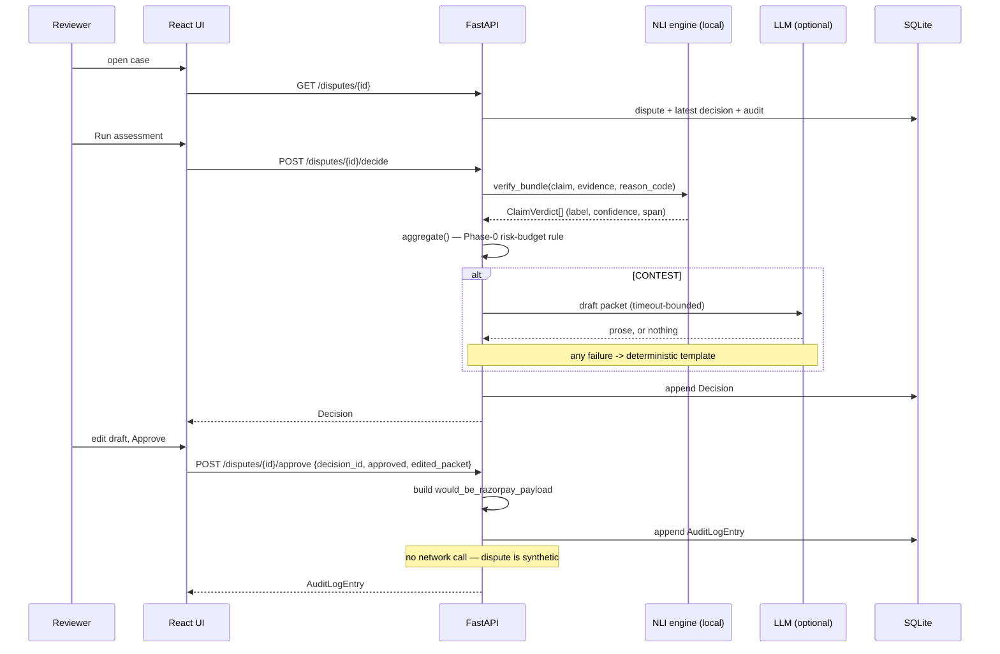

# Architecture

How Coconut is put together, and — more usefully — what didn't work and what the numbers
said. Every figure here was measured on this repo, not estimated.

---

## Contents

- [Request flow](#request-flow)
- [The two-signal verification engine](#the-two-signal-verification-engine)
- [Decision aggregation](#decision-aggregation)
- [The real-vs-synthetic boundary](#the-real-vs-synthetic-boundary)
- [Representment drafting](#representment-drafting)
- [Data and the held-out split](#data-and-the-held-out-split)
- [What broke, and what fixed it](#what-broke-and-what-fixed-it)
- [Where the safety constraints actually live](#where-the-safety-constraints-actually-live)

---

## Request flow



---

## The two-signal verification engine

`backend/app/services/verification_engine.py`

### The obvious design, and why it fails

The natural approach is to score each evidence item against the bank's claim with an NLI
model and map the labels through. Measured on the working set under the aggregation rule:

| | Naive (evidence vs claim) |
|---|---|
| Precision | **0.481** |
| Recall | 0.765 |
| Coverage | 0.423 |
| FP cost | ₹42,000 |

Precision below 0.5 is not "weak" — it is **inverted**. CONTEST fired on `contest_loss`
records 40% of the time versus `contest_win` 35%. Shipping that loses merchants money on
balance.

Two things were wrong, and neither is a tuning problem:

1. **Entailment cannot see evidentiary strength.** A gold-standard delivery proof and a
   bare "marked delivered" scan *both* contradict "the merchandise never arrived". The
   model correctly reports contradiction for both, because both do contradict it. The thing
   that separates a winning case from a losing one — how *specific* the proof is — is
   invisible to that question.
2. **Confidence carried no information.** 82% of verdicts came back at ~1.00, so the
   aggregation rule's `> 0.7` and `> 0.65` gates never bound on anything.

### The fix

Each evidence item is scored on two axes with the same cross-encoder:

| Signal | Question | Behaviour |
|---|---|---|
| **Engagement** | `NLI(evidence, bank's claim)` → contradiction. Does this evidence address the accusation at all? | Saturated. Nearly anything on-topic scores high. Weak discriminator, but a necessary gate. |
| **Substantiation** | `NLI(sentence, reason-code probe)` → max entailment. Is this evidence *specific enough* to prove the merchant's position? | Genuinely discriminative and bimodal. |

The probe is a short declarative per reason code — `"The customer received the goods."`,
`"The refund was paid to the customer."` A bare delivery scan engages the claim but does
not entail that the customer received anything; a signature plus OTP plus a matching name
does.

`confidence` is an equal-weight blend of the two. This is the load-bearing part: because
confidence now carries evidentiary strength, the aggregation rule's `avg > 0.65` gate does
real work, and its `min()` rule genuinely means "the weakest thing the merchant is relying
on" rather than being decorative.

| | Naive | Two-signal |
|---|---|---|
| Precision | 0.481 | **0.625** |
| Recall | 0.765 | 0.556 |
| Coverage | 0.423 | 0.214 |
| FP cost | ₹42,000 | **₹9,000** |

Direction is now correct and monotonic: CONTEST fires on `contest_win` 14% > `contest_loss`
9% > `should_accept` 2%.

### Things that were tried and rejected

| Approach | Result | Why rejected |
|---|---|---|
| Sentence-level max contradiction vs claim | separation **−17.1%** | Made it worse — more chances to find a spurious contradiction. |
| Long, specification-style probes | entailment ≈ 0 everywhere | SNLI/MNLI hypotheses are short declaratives; long ones score nothing. |
| Require every item to substantiate | coverage 13%, 1 CONTEST total | Real bundles pair one decisive item with context that legitimately substantiates ~0. |
| `SUPPORT_FLOOR = 0.50` | recall 0.556 → 0.333 | Downgraded contextual evidence to neutral; since the rule needs *all* verdicts to be `support`, each downgrade killed a whole bundle. |
| Substantiation cutoff at 0.005 | precision **0.800** | Tempting, but only 5 auto-CONTESTs across 182 records — ≈2 held-out. Precision from 2 samples is noise, not a result. |
| Exhaustive threshold sweep, 1,200 configurations | best cell: accuracy 0.643 vs 0.641, precision 0.632 vs 0.625 | One record's difference across 42 auto-decisions, and the cell sits directly against a cliff — its neighbour at `floor=0.65` collapses precision to 0.490. Not an improvement; a coin landing the same way twice. |
| Rank-normalised substantiation | F1 0.588 → **0.638**, coverage 0.214 → 0.341 | The best-looking F1 in this document. Rejected: precision fell 0.625 → 0.564 and false positives went 9 → 17, nearly doubling the cost the system exists to avoid. Rank is monotone, so it adds no information — it only moves along the tradeoff. |

The last row is worth dwelling on: it produces the best-looking number in this document and
was rejected precisely because it would not survive contact with the held-out set.

### Why tuning stopped here

The obvious next move is to tune the four engine thresholds harder. `eval/tune_thresholds.py`
caches the raw signals in one inference pass and replays 1,200 configurations in seconds, so
this was cheap to settle rather than argue about.

It does not help, and the diagnosis says why. Measured on the working set, the two signals
separate `contest_win` from everything else at:

| Signal | AUC |
|---|---|
| Substantiation (mean over items) | **0.571** |
| Engagement (mean over items) | 0.556 |
| Substantiation (min over items) | 0.515 |

An AUC of 0.57 is barely above chance. Thresholds choose an operating point on a curve; they
cannot add information to one. That single number explains every result above — why the sweep
found nothing beyond noise, why rank-normalisation bought recall by selling precision, and why
the 0.800-precision configuration evaporated on inspection.

Two distribution facts underneath it:

- **Engagement is saturated.** 39% of evidence items score above 0.99 and the 25th percentile
  is 0.004 — it is close to binary, not a gradient.
- **Substantiation is crushed against zero.** Median 0.005, 75th percentile 0.024. In
  `blended = 0.5·engagement + 0.5·substantiation` the second term contributes almost nothing
  numerically, which is why `ENGAGEMENT_THRESHOLD` and `DAMNING_THRESHOLD` turned out to be
  entirely inert in the sweep — every top configuration was identical across all five values
  of each.

The honest conclusion is that the ceiling here is the zero-shot NLI representation, not the
decision logic wrapped around it. Raising it means changing the signal — fine-tuning on
dispute-shaped data (out of scope, Section 16), or a probe set richer than one short
declarative per reason code. Re-weighting what is already there cannot do it.

### Explainability

`highlighted_span` is the sentence with the highest substantiation score — i.e. the line
that actually proves something. It is copied verbatim from the evidence, so the UI renders
it as an exact inline `<mark>` rather than an approximate match.

### The label inversion

The NLI hypothesis is the **bank's claim**, so labels invert on the way into a verdict:

| NLI label | Meaning | ClaimVerdict |
|---|---|---|
| contradiction | evidence refutes the bank | `support` |
| entailment | evidence confirms the bank | `contradict` |
| neutral | unresolved | `neutral` |

Getting this backwards would invert every recommendation in the system while still
producing plausible confidence scores and passing every other test. It is pinned by
`test_label_inversion_is_not_reversed`, and the model's own `id2label` order is re-checked
at load rather than trusted.

---

## Development-time risk budgeting, not a formal guarantee

`conformal_calibrator.py`

Section 10's `0.7` and `0.65` were picked. Phase 0 intentionally supersedes more than those
numbers: both decision branches use one threshold selected against an empirical
contest-error (false-discovery) rate plus a Hoeffding correction, and the unanimous-support
branch gates on the minimum support confidence rather than Section 10's average. The
weakest-link gate matches the score used by the risk-budget search; unanimity and >= 2
distinct evidence types remain structural constraints.

This implementation is a **prototype operating-point search**, not a valid finite-sample
Learn-then-Test guarantee. The working set used for this search was also used to develop the
score and aggregation rule, and scanning 50 thresholds needs a family-wise
multiple-testing procedure before a simultaneous claim can be made. The disjoint held-out
split below is an empirical evaluation only.

Measured on the same held-out set and model, comparing the complete operating rules:

| | Legacy Section 10 (average gate) | Phase 0 (weakest-link gate) |
|---|---|---|
| Precision | 0.625 | **0.692** |
| Recall | 0.625 | **0.750** |
| F1 | 0.625 | **0.720** |
| Coverage | 0.215 | **0.291** |

### The finding that matters more than the improvement

**The tightest budget this development sample supports is 0.710.** Every budget a user
would actually ask for comes back unsupported:

| Threshold | n | precision | Hoeffding slack | bound |
|---|---|---|---|---|
| 0.50 | 21 | 0.524 | 0.234 | 0.710 |
| 0.55 | 1 | 1.000 | 1.073 | 1.073 |
| 0.65+ | 1 | 1.000 | 1.073 | 1.073 |

The contest scores have almost no dynamic range: p25 0.49785, median 0.4999, p75 0.5027, and
exactly one of 42 model-eligible calibration points above 0.55. So the [0.50, 0.99] grid has two usable
settings — take everything, or take one case. And precision does not improve as the
threshold rises; it sits near 0.50 at every cut.

Rank-normalising the score to spread it across the grid was also tried and did not make its
ordering informative. This is another confirmation of the AUC ≈ 0.57 ceiling documented
below: a threshold search cannot manufacture information from a score that does not
discriminate.

The honest conclusion is that a useful operating point needs a better-calibrated confidence
signal — fine-tuning, or a richer probe set — not a better threshold search. A future formal
risk claim additionally needs independent calibration data and multiplicity control. The
default risk budget is set to 0.75 rather than something flattering so the current
limitation stays visible.

### Deviating from Addendum 3 Section 29

The spec says to split the held-out set 50/50 into calibration and test. Implemented
literally that gives only 12 contest-eligible calibration points. The prototype instead
runs threshold selection on the working set and its empirical check on the full held-out
set. They are disjoint, but the working set is not independent of score development, so
this choice trades away the right to make a formal claim in exchange for a larger
development sample.

`GET /verify-guarantee` keeps its historical route name for compatibility. It reports only
whether the chosen budget held empirically on the test split;
`test_conformal_calibrator.py` asserts the two id sets do not intersect.

---

## Deterministic rules before the model

`npci_rules.py` + `urcs_forecaster.py` + the short-circuit at the top of `aggregate()`

On UPI rails, NPCI's URCS decides a real share of dispute outcomes deterministically —
chargebacks beyond 10 per customer or 5 per payer-payee pair in a rolling 30 days are
auto-rejected under CD1 and CD2 without anyone reviewing them. So the caps are checked
**before** the NLI engine's verdicts are aggregated: if URCS will reject the chargeback on
the merchant's behalf, no amount of evidence quality changes what the merchant should do,
which is nothing.

```
forecast = forecast_urcs_disposition(dispute, payer_history)
if forecast.predicted_disposition == "AUTO_REJECT":
    -> NO_ACTION_NEEDED, confidence 1.0     # certainty about NPCI, not belief about evidence
else:
    -> Phase-0 risk-budget rule
```

Three properties worth naming:

- **It is a rules engine, not a model.** A pure function over counters. No inference, no
  LLM, no probability. That is why it is fully explainable and why it can run on every
  page load.
- **Its provenance is visible.** Every value carries the circular it came from and the
  date it was verified, and that date travels on every forecast into the UI.
- **It refuses to over-claim.** `AUTO_ACCEPT` is never returned, because that branch turns
  on the beneficiary bank's TCC/RET in the following settlement cycle, which this system
  has no visibility into. A fuller-looking enum would be a lie with four branches.

### A convergence worth naming

This ordering — deterministic logic first, model second — was chosen here for the reason
above, and only afterwards found to match the architecture Razorpay describes in its own
engineering write-up, **"Meet Bumblebee: Agentic AI Flagging Risky Merchants in Under 90
Seconds"** (Razorpay engineering blog / dev.to, December 2025). Bumblebee likewise runs
deterministic checks ahead of model reasoning, degrades to human review rather than
guessing on thin evidence, and logs every decision for replay.

The convergence is the point, so it is stated rather than buried: the same three
constraints — cost, auditability, and the unacceptability of a confident wrong answer —
push independent designs to the same shape. All three properties predate the discovery in
this codebase; they are visible in the abstention path, the audit trail, and the
`min()` confidence rule, none of which were added afterwards.

---

## Decision aggregation

`backend/app/services/decision_aggregator.py` — a plain conditional, deliberately not a
learned model. A merchant needs to read why the system said what it said.

```
if no calibrated threshold is active                     -> NEEDS_HUMAN_REVIEW
if any verdict is `contradict` with confidence >= lambda -> ACCEPT
elif all verdicts are `support`
     and min(confidence) >= lambda
     and >= 2 distinct evidence types among them          -> CONTEST
else                                                      -> NEEDS_HUMAN_REVIEW

overall_confidence = min(confidence over the verdicts that DROVE the decision)
```

This is an intentional operating-rule change, not a threshold-only substitution. The legacy
Section 10 baseline used `> 0.7` for contradiction and `average(confidence) > 0.65` for
unanimous support; its `min()` calculated only the confidence reported after the branch had
already fired. Phase 0 uses the weakest link as the CONTEST gate because it is the exact score
against which the risk-budget operating point is selected.

Three details that are easy to get wrong and are pinned by tests:

- The active threshold comparisons are inclusive (`>=`).
- With no supported active threshold, the engine abstains rather than falling back to a
  picked default.
- The `min()` is over the verdicts that *drove* the decision, not all of them — a
  low-confidence verdict that didn't participate must not drag the reported number down.

`AggregationResult.rationale` names the specific condition that failed ("support rests on
only 1 evidence type"), so the UI and audit trail explain outcomes without re-deriving the
rule.

---

## The real-vs-synthetic boundary

| Real | Synthetic |
|---|---|
| Razorpay orders (`order.create`) | `dispute_id`, `phase`, `reason_code` |
| Payments completed via Checkout | `claim_text`, `evidence_bundle` |
| Payment links | `ground_truth_label` |

Razorpay has no API to fabricate either a chargeback *or* a payment — both were verified
against the live API, not assumed. `POST /v1/payments/create/json` and `.../create/upi`
both return 404 on a standard test account; server-side card payments require per-account
PCI-DSS enablement. So payments come from a real Checkout interaction, and disputes are
generated.

**Consequence for `/approve`:** approving the current decision requires its `decision_id`;
approving a CONTEST builds the exact contest payload,
stores it in `would_be_razorpay_payload`, sets `submitted_to_razorpay = True`, and makes no
network call. The flag means *"prepared and logged as if submitted"*, never *"sent"*.

Draft saves and packet exports carry the same decision token, and withdrawal requires the
specific standing `approval_id`. Stale tabs therefore fail with `409` instead of mutating a
newer assessment or approval. A per-dispute process lock makes each local SQLite
load/check/commit sequence atomic; a multi-worker deployment must replace it with database
compare-and-swap or row locking.

This is enforced in two independent layers:

1. `routes.approve()` never invokes the client for a synthetic dispute.
2. `razorpay_client._dispute_call()` — the single choke point for every dispute-side
   operation — inspects the id first and refuses. There is deliberately no override flag.

`test_razorpay_client.py` substitutes an SDK stub that **raises on any attribute access**,
so a regression fails loudly rather than quietly reaching the network. A companion test
confirms the guard is narrow enough that a genuine dispute id still sends.

---

## Representment drafting

`packet_generator.py` (template) + `packet_llm.py` (providers)

```
CONTEST decision
      │
      ├─ build deterministic template from supporting verdicts + spans
      │
      └─ if a provider is configured:  Gemini → Anthropic
             ├─ success + keeps source refs  → use it
             ├─ dropped every source ref     → discard, use template
             ├─ error / timeout / empty      → use template
             └─ no key                       → template
```

The template is a **supported path, not a degraded one**. It is built from the engine's own
findings — it cites each supporting item, quotes the span that drove the verdict, and
reports the weakest-link confidence — so it is grounded even without an LLM. A demo that
needs a network round-trip to produce its main artefact is a demo that can fail live.

An LLM draft that drops every `source_ref` is rejected: fluent prose citing nothing is
worse than a plain document citing evidence.

The model id is **discovered at runtime**, not pinned. See below for why.

---

## Data and the held-out split

261 records → stratified 70/30 → 182 working / 79 held-out.

- **Stratified, not random.** An unstratified 30% of ~260 records can skew label balance by
  several points, moving reported precision for reasons unrelated to model quality.
  Achieved: working 40.7/31.9/27.5 vs held-out 40.5/31.6/27.8.
- **The held-out set is never seeded into the database.** `/evaluate` reads the file
  directly. Keeping it out of the queue is a structural guarantee against leakage rather
  than a convention, asserted by `test_held_out_records_are_never_seeded`.
- **Timestamps are rebased at seed time.** The committed dataset has absolute dates; without
  rebasing, a clone made weeks later shows an entirely overdue queue. The whole set shifts
  by one offset, preserving the original urgency spread.

---

## What broke, and what fixed it

| Failure | How it surfaced | Fix |
|---|---|---|
| Verification precision 0.481, **inverted** | Measured the naive engine before building on it | Two-signal design → 0.625 |
| `RuntimeError: Already borrowed` under concurrent `/decide` | Batch-assessing from the queue; two tabs would have done it | HuggingFace's fast tokenizer is a Rust object that panics on concurrent entry, and FastAPI runs sync endpoints in a threadpool. Serialised inference behind a dedicated lock |
| `razorpay` 1.4.2 cannot import on Python 3.12+ | `ModuleNotFoundError: pkg_resources` | Pin `>=2.0`. Would have hit every fresh clone |
| Gemini 503 hung `/decide` for **296 seconds** | First live drafting call | Bounded timeout + retries → 296s → 41.6s → **3.2s** |
| `gemini-2.5-flash`, `gemini-2.0-flash` → **404** | Probed the live key instead of trusting recall | Discover models from the API; the ids most likely hard-coded from memory don't resolve |
| `gemini-flash-latest` → 504 after 14.4s | Same probe | Reordered preference to `flash-lite` variants (0.8s) |
| Test suite started calling Gemini once a key existed | Suite time jumped | Autouse fixture disables the LLM path; 127s → 58s |
| `SUPPORT_FLOOR` change cost 40% of recall | Re-measured after the change | Reverted to 0.45 |
| Payment link rejected `4111 1111 1111 1111` | "International cards are not supported" | Indian test accounts block international cards — use UPI `success@razorpay` |
| Stale uvicorn served a router-less build | `/health` answered, `/disputes` 404'd | Port hygiene; environmental, not a code bug |
| Payment-link creation rate-limited | 7 of 12 failed with "Too many requests" | Capped and throttled |

The pattern worth noting: the first four were all found by *running the thing and measuring*,
and four of them would have been invisible to code review.

---

## Where the safety constraints actually live

Constraints that exist only in a README are decoration. Each of these is enforced in code
and guarded by a test:

| Constraint | Enforced in | Guarded by |
|---|---|---|
| Test-mode keys only; refuse to boot otherwise | `config.py` — no override flag exists | `test_config.py` (11 cases) |
| **No** dispute id may reach the live dispute API | `razorpay_client.may_reach_razorpay()` — fails closed | `test_razorpay_client.py` — every action, every id shape |
| No submission without human approval | `/approve` is the only writer of those flags | `test_api.py`, `test_write_paths.py` |
| Held-out data never enters development | Seeder reads only the working set | `test_db.py` |
| Ground truth is not settable through the API | absent from `DisputeCreate` | `test_write_paths.py` |
| Webhooks are refused unless signed | `webhooks.py` — no secret, no acceptance | `test_webhooks.py` (13 cases, mutation-checked) |
| Real dispute events are never ingested | `webhooks.py` acknowledges, never writes | `test_webhooks.py` |
| Drafting failure never loses a decision | `generate_packet()` fallback chain | `test_packet_generator.py` — injected timeouts, errors, malformed responses |

The UI states the first three in a persistent header strip, because a demo audience does
not read the README either.

### The guard that was wrong

The network guard originally asked *"does this id start with `disp_synthetic_`?"* and sent
anything else to the live dispute API. That is an allowlist written inside out. It held
only because every id in the database happened to carry that prefix — adding hand-filed
disputes (`disp_manual_`) would have walked straight through it, and so would a typo.

It now fails closed: a call is permitted only for an id positively identified as a real
Razorpay dispute, and since Section 3 states this system never ingests one, that set is
empty by construction. The function exists rather than a bare `return False` so that the
day a real ingestion path is added, there is exactly one place to state what qualifies.

The same inversion shows up in the webhook: no configured secret means every request is
refused, not that unsigned events are accepted.
