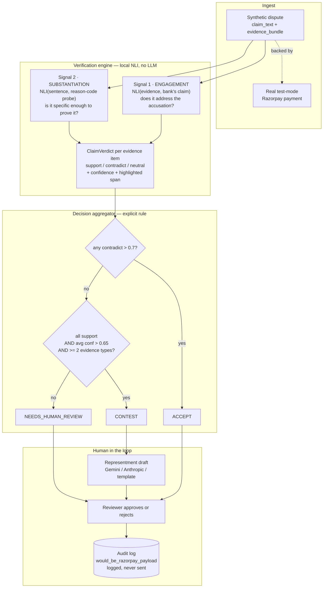

# Recourse — Explainable Chargeback Defense Copilot

Recourse takes a payment dispute, checks each piece of evidence against the specific claim
the bank is making, and recommends **CONTEST** or **ACCEPT** with a confidence score and a
full audit trail — or says **NEEDS_HUMAN_REVIEW** when the evidence genuinely doesn't
resolve the claim, instead of guessing. If contesting, it drafts the representment text. A
human approves before anything is treated as final, and nothing is ever submitted to
Razorpay or a bank automatically. Built for Razorpay's AI Buildathon, Track 2 (AI Risk
Manager).

---

## The problem

Chargebacks are adjudicated on evidence, but the economics push merchants toward not
bothering:

- A representment costs staff time and a fixed fee per case (this repo assumes
  **₹1,500**, configurable via `ASSUMED_REPRESENTMENT_COST_INR`). Below some ticket size,
  contesting costs more than conceding.
- So a large share of disputes are **never contested at all** — conceded by default, not
  on the merits.
- The ones that *are* contested are often contested badly: a representment that ships a
  bare "delivered" scan with no signature, OTP or address match loses, and the merchant
  pays the fee on top of the lost transaction.

The expensive mistake is therefore **not** failing to contest. It's contesting cases you
were going to lose — you pay twice. That is why this system optimises for precision on the
cases it decides, and routes everything else to a human rather than guessing.

The hard part is that "we have delivery proof" and "we have *good* delivery proof" look
almost identical to a language model. Most of the engineering here is about that gap.

### Where this sits next to Razorpay's own Agent Studio

Razorpay's Agent Studio already ships a **Dispute Responder Agent**, alongside Abandoned
Cart Conversion and Subscription Recovery agents, launched publicly with Anthropic on the
Claude Agent SDK. This project is not pretending that space is empty.

What it does instead is take a position those products do not: it optimises for **precision
on the cases it decides and abstains on the rest**, and it adds a component built for the
rails Razorpay actually runs on — see [UPI dispute forecasting](#upi-the-part-nobody-else-builds-for)
below. Where an agent answers disputes, this decides which disputes are worth answering at
all, and refuses to guess when the evidence will not carry it.

---

## Architecture



**Why a local NLI model and not an LLM for the decision.** The verdict must be
deterministic, reproducible by anyone cloning this repo, and free to run thousands of
times during evaluation. `cross-encoder/nli-deberta-v3-base` runs locally on CPU with no
API key, no rate limit and no per-call cost. An LLM is used only to rewrite prose *after*
the decision is made — it cannot change a recommendation, a verdict or a confidence.

**Why two signals.** See [ARCHITECTURE.md](ARCHITECTURE.md#the-two-signal-verification-engine).
Scoring evidence against the claim alone produced **precision 0.481** — worse than a coin
flip, and inverted: it fired CONTEST on losing cases *more often* than winning ones.

---

## Name your risk budget, not a threshold

Section 10 of the spec hard-coded `0.7` and `0.65`. Nothing justified those numbers — they
were picked. In a track whose bar is measured precision on a held-out set, "I picked them"
is a bad answer.

So they are gone. You now state the **maximum false-positive rate you can live with**, and
the threshold is *calibrated* to satisfy it:

    lambda = min { lambda : R(lambda) + sqrt(log(1/delta) / (2 n_lambda)) <= alpha }

where `R(lambda)` is the empirical false-positive rate among cases the system would
auto-contest at `lambda`, and the square-root term is a Hoeffding correction for finite
samples. Learn-then-Test style bounded risk control, ~40 lines, in
[`conformal_calibrator.py`](backend/app/services/conformal_calibrator.py).

> With probability at least 1 − δ over the draw of the calibration set, the false-positive
> rate among disputes the system auto-contests is at most α, assuming calibration and
> deployment data are exchangeable.

**It beat the hand-picked thresholds.** Same held-out set, same model, only the threshold
changed:

| | Section 10 (0.7 / 0.65) | Calibrated |
|---|---|---|
| Precision | 0.625 | **0.692** |
| Recall | 0.625 | **0.750** |
| F1 | 0.625 | **0.720** |
| Coverage | 0.215 | **0.291** |

`POST /calibrate` sets the budget; `GET /verify-guarantee` checks whether it actually held,
on a test split that shares no dispute ids with the calibration data. That endpoint exists
so the system can prove itself wrong.

### What the guarantee is not

Stated up front rather than buried, because these are the parts that matter:

1. **The tightest budget this data supports is ~72%.** Not a typo. The method is correct;
   the *score* it calibrates has almost no dynamic range — contest scores cluster at 0.500
   (p25 0.498, median 0.500, only 1 of 48 above 0.55) and precision does not improve as the
   threshold rises. That is the same AUC ≈ 0.57 ceiling documented in
   [ARCHITECTURE.md](ARCHITECTURE.md#why-tuning-stopped-here), reappearing as an
   unachievable guarantee. Ask for 5% and the system says so and defers everything, rather
   than pretending. **A tight, meaningful guarantee here needs a better-calibrated
   confidence signal, not a better threshold search.**
2. **Calibration data is synthetic.** The guarantee holds relative to that distribution and
   does not automatically transfer to real disputes.
3. **Exchangeability is an assumption.** Real dispute streams drift — seasonal fraud, new
   attack modes — which breaks it. Handling that needs adaptive/online conformal methods,
   out of scope here.
4. **The bound is on false-positive rate only** — not recall, not money recovered.

One deviation from the spec, deliberately: Addendum 3 says to split the held-out set 50/50
for calibration and test. That leaves 12 contest-eligible calibration points, where the
Hoeffding slack alone is 0.31 and the floor is 0.539. Calibration therefore runs on the
**working set** and verification on the **full held-out set** — disjoint by construction,
and it avoids spending held-out data to pick a threshold, which is exactly what the rest of
this repo refuses to do.

Grounding: split conformal prediction (Vovk et al. 2005; Papadopoulos et al. 2002),
conformal risk control (Bates et al. 2021; Angelopoulos et al. 2024), selective
classification and deferral (Chow; El-Yaniv & Wiener 2010; Geifman & El-Yaniv 2017).
Active 2026 applications span drug discovery, medical foundation models, GUI agents and
financial ranking — **not payment disputes**, which is the novelty claim here, and it is
checkable.

---

## UPI: the part nobody else builds for

Every commercial chargeback-AI product surveyed — Justt, Chargeflow, Riskified Dispute
Resolve, Kount, Signifyd, Chargeback Specialist — is architected around **card-network**
mechanics: Visa VAMP, Mastercard ECM, card reason-code taxonomies, and a human adjudicator
at the network. India's UPI rails work differently in a way that is mechanical, not
cosmetic:

| Rule | What it does | Source |
|---|---|---|
| Dispute caps | 10 chargebacks per customer per rolling 30 days (11th → **CD1**); 5 per payer-payee VPA pair (6th → **CD2**) | NPCI circular, 5 Dec 2023 |
| URCS auto-disposition | Auto-accepts/rejects on the beneficiary bank's TCC or return, bulk-upload and UDIR only | UPI OC No. 213 FY 2024-25, from 15 Feb 2025 |
| RGNB | Remitting bank may re-raise a CD1/CD2 auto-decline in good faith, front-end only | NPCI OC No. 184B/2025-2026, from 15 Jul 2025 |

**The consequence is the whole idea.** On UPI rails a meaningful share of dispute outcomes
is decided by a deterministic rules engine, not by human judgement — which makes them
predictable *exactly*, in advance, rather than statistically. So Recourse forecasts NPCI's
disposition before the merchant spends anything, and recommends `NO_ACTION_NEEDED` when
URCS is expected to reject the chargeback on the merchant's behalf.

It is a rules engine, not a model: a pure function over counters, fully explainable, no
inference. The rules live in one config block,
[`npci_rules.py`](backend/app/services/npci_rules.py), each with the circular it came from
and the date it was last verified — and that date is rendered in the UI, because NPCI has
revised these rules three times in two years and a rules engine with invisible provenance
is one nobody should trust.

**What it deliberately does not claim:** `AUTO_ACCEPT` is never predicted. That branch
depends on the beneficiary bank's TCC or return in the settlement cycle *after* the
chargeback is raised, which this system cannot see. It reports `PROCEEDS_TO_MERCHANT` and
says so.

Cap-breach cases are excluded from precision and recall and counted separately under
`auto_resolved`, for the same reason human referrals are: crediting the model for work
NPCI's rules engine did would inflate the headline number.

---

## Setup

**Prerequisites:** Python 3.11+ and Node 18+. Tested on Python 3.13 / Node 24.

```bash
git clone <repo-url>
cd recourse
cp .env.example .env
```

### Credentials

Only the Razorpay pair is required.

| Variable | Required | Where to get it |
|---|---|---|
| `RAZORPAY_KEY_ID` / `RAZORPAY_KEY_SECRET` | **yes** | [Razorpay Dashboard](https://dashboard.razorpay.com/) → toggle to **Test Mode** → Account & Settings → API Keys → Generate Key. **Free, and no KYC needed for test mode.** |
| `GEMINI_API_KEY` | no | [Google AI Studio](https://aistudio.google.com/apikey) — free tier. Improves representment prose. |
| `ANTHROPIC_API_KEY` | no | [Anthropic Console](https://console.anthropic.com/) — paid. Alternative to Gemini. |

The key id **must** begin with `rzp_test_`; the app refuses to start otherwise, by design.
With no LLM key at all, packets are produced by a deterministic template and everything
else works identically.

### Install and run

```bash
python -m venv .venv
# Windows:      .venv\Scripts\activate
# macOS/Linux:  source .venv/bin/activate
pip install -r backend/requirements.txt

cd backend
python -m app.db.seed          # loads 182 disputes into SQLite
cd ../frontend && npm install
```

First run downloads the NLI model (~750MB) from Hugging Face and caches it.

---

## Running it in one command (Docker)

```bash
cp .env.example .env      # add your rzp_test_ keys
docker compose up --build # -> http://localhost:8000
```

One image, one process, one port: the frontend is built in a Node stage and served by
FastAPI alongside the API. There is no CORS hop and no second terminal.

The API lives under `/api` there, which is the prefix the frontend already calls in
development, so the same build works in both places without a base-URL variable. The two
are composed rather than merged for a specific reason: the API owns `/disputes` and the
frontend routes on the same path, so a merged app would serve JSON to anyone who pasted a
case URL into their browser. See `backend/app/server.py`.

The NLI model (~750MB) is **not** baked into the image — it downloads on first start into a
named volume, so it is fetched once rather than per container, and you can always tell which
weights are running. Expect the first boot to take a few minutes; `/ready` returns 503 until
the model is in memory, and the container's healthcheck waits on it.

An empty database seeds itself on first start, so the queue is populated without a separate
step. Both the database and the model cache live in named volumes and survive
`docker compose down`.

> **Not verified on this machine.** Docker is not installed on the machine this was built
> on, so the compose file and Dockerfile are written but have never been built. The
> single-origin server they run (`uvicorn app.server:site`) *is* verified — see below. If
> the build needs a fix, that is where to look first.

To run that same single-origin server without Docker:

```bash
cd frontend && npm run build
cd ../backend && uvicorn app.server:site --port 8000   # -> http://localhost:8000
```

---

## Running it

Two terminals.

**Backend** (from `backend/`):

```bash
uvicorn app.main:app --reload
```
→ http://127.0.0.1:8000 · health at `/health` · interactive docs at `/docs`

**Frontend** (from `frontend/`):

```bash
npm run dev
```
→ http://localhost:5173

The dev server proxies `/api/*` to the backend, so there is no base URL to configure.

**The app has four surfaces:**

| | |
|---|---|
| **Overview** | Money at stake, what closes soonest, what is worth contesting, exposure by dispute type |
| **Disputes** | The queue — filter by what Recourse concluded, sort by deadline or value |
| **Case** | The bank's claim and the recommendation, then Evidence / Representment / Audit behind tabs |
| **Performance** | The held-out evaluation, re-runnable live |

**The loop:** *Assess 25 disputes* on Overview → open a case from *Ready to contest* → read the
per-evidence verdicts and the highlighted sentence that drove each → *Representment* tab, edit
the draft → *Approve & prepare packet* → the *Audit* tab shows the "would submit to Razorpay"
payload → *Performance* → *Run evaluation*.

Light and dark themes both ship; the toggle is at the foot of the sidebar.

### Backing disputes with real Razorpay payments

Section 7 wants each dispute's `payment_id` to point at a genuine test-mode payment. Most
seeded disputes still carry a `pay_PENDING_` placeholder, and the reason is worth stating
plainly rather than hiding: **Razorpay exposes no endpoint that fabricates a payment.**
Orders are creatable over the API; a payment only comes into existence when someone
completes a Checkout interaction. Server-to-server payment creation
(`payment.createUpi`, `payment.createPaymentJson`) returns 404 on a standard test account,
so there is no API-only route to a real `pay_...` id.

The app therefore does the part software can do and stops where a person is required --
the same shape as the approve flow. **Open any dispute whose payment reads `placeholder`
and click "Attach a real test payment":**

1. A real test-mode order is created against your account (visible in the Razorpay
   dashboard) and stored on the dispute.
2. Razorpay Checkout opens in test mode, branded, for the dispute's amount.
3. Pay with **UPI and the test VPA `success@razorpay`**. The generic
   `4111 1111 1111 1111` card is treated as *international* and Indian test accounts
   reject it.
4. The backend reads the payment id back **off the order via the Razorpay API** -- not
   from the browser callback -- and promotes it onto the dispute. The case page relabels
   the payment `real`.

Only `captured` or `authorized` payments are promoted. A failed or abandoned attempt is
never attached, because a dead id on the dispute would make the "backed by a real payment"
claim false -- the one thing this flow exists to make true.

Repeat pressing is safe: an existing order is reused rather than creating a new one each
time, and a dispute that is already backed refuses a second order with a 409.

**There is deliberately no script that completes checkouts in bulk.** Razorpay's checkout
is protected by a captcha, and automating past it would mean circumventing a
bot-protection control on someone else's production infrastructure. Backing is a
deliberate, per-dispute act.

The older batch tooling still exists for creating orders and payment links ahead of time:

```bash
cd backend
python data/backfill_razorpay_backing.py --limit 12 --with-payment-links
python data/backfill_razorpay_backing.py --refresh-payments-only
python data/verify_razorpay_backing.py     # checks all three acceptance criteria
```

---

## Regenerating the synthetic data

The dataset is committed, so this is never required to run the app.

```bash
cd backend
python data/generate_synthetic_disputes.py --source curated   # no API key needed
python data/generate_synthetic_disputes.py --source api --n 260   # needs ANTHROPIC_API_KEY
```

Both paths feed the same validation, normalisation and stratified 70/30 split. Regenerating
overwrites `eval/held_out_set.json`, which invalidates the numbers below — the split is
seeded and reproducible, but a *different* dataset is a different experiment.

The UPI rails were added to the committed dataset by augmenting it in place rather than
regenerating, precisely to avoid that:

```bash
python data/add_upi_rails.py --report   # show what it would do
python data/add_upi_rails.py            # assign rail + payer_ref, build the cap clusters
```

The conformal calibration scores are cached too — one NLI pass, so moving the risk-budget
slider is instant:

```bash
python eval/build_conformal_cache.py
```

Assignment is by hash of `dispute_id` and is blind to labels and to what the engine
recommends, so it cannot be tuned to flatter a metric. Rerunning is idempotent.

---

## Running the evaluation

```bash
cd backend
python eval/run_evaluation.py          # or POST /evaluate, or the Performance page
pytest -q                              # 165 tests
```

### Tuning, and why it stopped

```bash
python eval/tune_thresholds.py --build-cache   # one inference pass over the working set
python eval/tune_thresholds.py                 # replay 1,200 configurations in seconds
```

The sweep holds CLAUDE.md Section 10's aggregation rule fixed — that rule is specified
literally, and moving those numbers would be tuning away the spec. It only varies the four
constants the engine defines for itself.

It finds nothing worth shipping, and says why: the two signals separate `contest_win` from
everything else at **AUC 0.571** and **0.556**. Thresholds pick an operating point on a curve;
they cannot add information to one. The best cell in 1,200 beats the shipped configuration by
0.2 points of accuracy — one record out of 42 — while sitting directly against a cliff where
precision collapses to 0.490. Details in
[ARCHITECTURE.md](ARCHITECTURE.md#why-tuning-stopped-here).

### Results — held-out set, last real run

79 records, never inspected or tuned against during development (CLAUDE.md Section 9).
CONTEST is the positive class.

Re-run after the UPI rails were added to the dataset. The confusion matrix is unchanged —
all five cap-breach cases came out of the human-review bucket, not the decided one — so
precision, recall, F1 and coverage all held exactly. That was not engineered: breach
records are selected blind, by hash, with no look at labels or at what the engine
recommends.

| Metric | Value |
|---|---|
| Precision | **0.692** |
| Recall | **0.750** |
| F1 | **0.720** |
| Coverage | **0.291** |
| False-positive cost estimate | **₹6,000** |
| Records evaluated | 79 |

| | Count | Meaning |
|---|---|---|
| TP | 9 | model CONTEST, truth `contest_win` |
| FP | 4 | model CONTEST, truth `contest_loss` / `should_accept` |
| FN | 3 | model ACCEPT, truth `contest_win` |
| TN | 7 | model ACCEPT, truth `contest_loss` / `should_accept` |
| Flagged to human | 51 | routed to a person instead of guessed |
| URCS auto-resolved | 5 | over an NPCI cap — rejected without the merchant, excluded from precision and recall |

**How to read these.** Coverage of 0.215 means the system auto-decides about a fifth of the
queue and hands back the rest. That is the intended behaviour, not a shortfall — the
product thesis is that a copilot which says "I don't know" on 79% of cases and is right
about 5 in 8 of the rest is more useful than one that guesses confidently on everything.

**The number that actually validates the work** is not 0.625 but its agreement with the
working set. Every threshold was tuned on `synthetic_disputes.json`; the held-out set was
opened once, at the end:

| | Working set (tuned on) | Held-out (never seen) |
|---|---|---|
| Precision | 0.625 | 0.625 |
| Coverage | 0.214 | 0.215 |
| Recall | 0.556 | 0.625 |

Near-identical out of sample means the design generalised rather than being fitted to
noise. For contrast, the naive single-signal engine scored **0.481** precision on the same
working set.

---

## Limitations

Stated plainly.

- **The dispute records are synthetic.** Razorpay's test mode has no mechanism to fabricate
  a chargeback, so there is no real disputable transaction to build against. `claim_text`,
  `evidence_bundle` and `ground_truth_label` are Claude-generated. The `payment_id` a
  dispute points at *can* be a real test-mode payment, and one in the committed set is.
- **Nothing is ever auto-submitted.** On approval the system builds the exact payload it
  *would* send, stores it in the audit log, and labels it "would submit to Razorpay". It
  does not make the call. This is enforced in two independent places and tested in both.
- **The NLI model is zero-shot, not fine-tuned.** Fine-tuning on dispute-shaped data is the
  obvious route to better numbers and is deliberately out of scope here.
- **Ground truth is generated, not observed.** Labels reflect how a well-informed person
  would judge each bundle, not the outcome of a real bank adjudication. The metrics measure
  agreement with that judgement.
- **Retrieval-phase claims are handled poorly.** They are phrased as documentation
  *requests* ("Issuer requests proof of delivery") rather than accusations, so the
  "does this evidence contradict the claim" signal does not apply and they tend to land in
  human review. Visible in the queue; a per-phase prompt would fix it.
- **Coverage is low by construction.** Tightening the engine for precision roughly halved
  it. That trade is deliberate and documented above.

---

## What's next, and what was discarded

**Evidence Gap Advisor — planned, not built.** The idea: run the Section 10 aggregation
rule in reverse, substituting a canonical strong exemplar for each evidence type a case is
missing, to tell a merchant *before the deadline* which specific missing document would
flip a borderline case from "unclear" to "contest". No new model — the same rule, run
backwards.

It was designed, then demoted. On re-examination, ROI-based fight-or-accept decisioning is
already commercially available (Justt markets it directly), so it was not the differentiator
it first appeared to be. The UPI rules engine above was: no surveyed vendor models NPCI's
mechanics, because their product architecture assumes a human adjudicator at a card network.

---

## What this generalises to

The reusable core is not chargeback-specific: it is a **claim-verification loop** that
takes an assertion and a bundle of evidence, scores each item on whether it *engages* the
assertion and whether it *substantiates* a position specifically enough to act on, and
abstains when the evidence does not separate the two. Track 2's other directions have that
same shape — return-risk scoring asks whether a return reason is corroborated by the
account's own history, and abuse-ring detection asks whether shared signals across accounts
substantiate a link or merely co-occur. Both would reuse the two-signal scorer, the explicit
aggregation rule, the abstention path and the audit trail, swapping only the probe set and
the evidence adapters. Neither is built here; this repo does one loop end to end.

One honest note on measurement. Razorpay's own published results for **Bumblebee**, its
agentic merchant-risk system, report *system reliability* — task completion rate, 88% to
99%+ — rather than decision accuracy against labelled outcomes. That is a reasonable thing
to report for an agent pipeline, and it is a different question from the one `/evaluate`
answers here. This project reports precision, recall and false-positive cost against a
held-out set precisely because that measurement is complementary to, not a substitute for,
the reliability numbers the public material shows.
