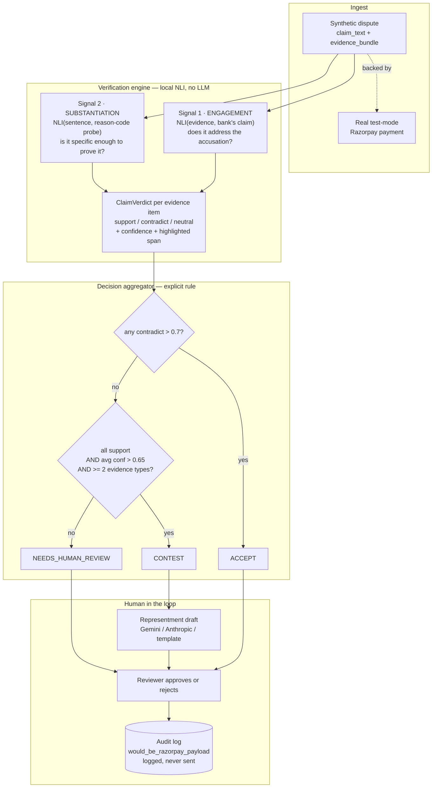

# Recourse — Explainable Chargeback Defense Copilot

Recourse takes a payment dispute, checks each piece of evidence against the specific claim
the bank is making, and recommends **CONTEST** or **ACCEPT** with a confidence score and a
full audit trail — or says **NEEDS_HUMAN_REVIEW** when the evidence genuinely doesn't
resolve the claim, instead of guessing. If contesting, it drafts the representment text. A
human approves before anything is treated as final, and nothing is ever submitted to
Razorpay or a bank automatically. Built for Razorpay's AI Buildathon, Track 2 (AI Risk
Manager).

---

## The problem

Chargebacks are adjudicated on evidence, but the economics push merchants toward not
bothering:

- A representment costs staff time and a fixed fee per case (this repo assumes
  **₹1,500**, configurable via `ASSUMED_REPRESENTMENT_COST_INR`). Below some ticket size,
  contesting costs more than conceding.
- So a large share of disputes are **never contested at all** — conceded by default, not
  on the merits.
- The ones that *are* contested are often contested badly: a representment that ships a
  bare "delivered" scan with no signature, OTP or address match loses, and the merchant
  pays the fee on top of the lost transaction.

The expensive mistake is therefore **not** failing to contest. It's contesting cases you
were going to lose — you pay twice. That is why this system optimises for precision on the
cases it decides, and routes everything else to a human rather than guessing.

The hard part is that "we have delivery proof" and "we have *good* delivery proof" look
almost identical to a language model. Most of the engineering here is about that gap.

---

## Architecture



**Why a local NLI model and not an LLM for the decision.** The verdict must be
deterministic, reproducible by anyone cloning this repo, and free to run thousands of
times during evaluation. `cross-encoder/nli-deberta-v3-base` runs locally on CPU with no
API key, no rate limit and no per-call cost. An LLM is used only to rewrite prose *after*
the decision is made — it cannot change a recommendation, a verdict or a confidence.

**Why two signals.** See [ARCHITECTURE.md](ARCHITECTURE.md#the-two-signal-verification-engine).
Scoring evidence against the claim alone produced **precision 0.481** — worse than a coin
flip, and inverted: it fired CONTEST on losing cases *more often* than winning ones.

---

## Setup

**Prerequisites:** Python 3.11+ and Node 18+. Tested on Python 3.13 / Node 24.

```bash
git clone <repo-url>
cd recourse
cp .env.example .env
```

### Credentials

Only the Razorpay pair is required.

| Variable | Required | Where to get it |
|---|---|---|
| `RAZORPAY_KEY_ID` / `RAZORPAY_KEY_SECRET` | **yes** | [Razorpay Dashboard](https://dashboard.razorpay.com/) → toggle to **Test Mode** → Account & Settings → API Keys → Generate Key. **Free, and no KYC needed for test mode.** |
| `GEMINI_API_KEY` | no | [Google AI Studio](https://aistudio.google.com/apikey) — free tier. Improves representment prose. |
| `ANTHROPIC_API_KEY` | no | [Anthropic Console](https://console.anthropic.com/) — paid. Alternative to Gemini. |

The key id **must** begin with `rzp_test_`; the app refuses to start otherwise, by design.
With no LLM key at all, packets are produced by a deterministic template and everything
else works identically.

### Install and run

```bash
python -m venv .venv
# Windows:      .venv\Scripts\activate
# macOS/Linux:  source .venv/bin/activate
pip install -r backend/requirements.txt

cd backend
python -m app.db.seed          # loads 182 disputes into SQLite
cd ../frontend && npm install
```

First run downloads the NLI model (~750MB) from Hugging Face and caches it.

---

## Running it

Two terminals.

**Backend** (from `backend/`):

```bash
uvicorn app.main:app --reload
```
→ http://127.0.0.1:8000 · health at `/health` · interactive docs at `/docs`

**Frontend** (from `frontend/`):

```bash
npm run dev
```
→ http://localhost:5173

The dev server proxies `/api/*` to the backend, so there is no base URL to configure.

**The app has four surfaces:**

| | |
|---|---|
| **Overview** | Money at stake, what closes soonest, what is worth contesting, exposure by dispute type |
| **Disputes** | The queue — filter by what Recourse concluded, sort by deadline or value |
| **Case** | The bank's claim and the recommendation, then Evidence / Representment / Audit behind tabs |
| **Performance** | The held-out evaluation, re-runnable live |

**The loop:** *Assess 25 disputes* on Overview → open a case from *Ready to contest* → read the
per-evidence verdicts and the highlighted sentence that drove each → *Representment* tab, edit
the draft → *Approve & prepare packet* → the *Audit* tab shows the "would submit to Razorpay"
payload → *Performance* → *Run evaluation*.

Light and dark themes both ship; the toggle is at the foot of the sidebar.

### Backing disputes with real Razorpay payments

```bash
cd backend
python data/backfill_razorpay_backing.py --limit 12 --with-payment-links
python data/verify_razorpay_backing.py     # checks all three acceptance criteria
```

This creates **real test-mode orders** via the Razorpay API. Razorpay has no API to
fabricate a *payment*, so to get a real `pay_...` id, open one of the printed payment links
and complete it. Use **UPI with the test VPA `success@razorpay`** — the generic
`4111 1111 1111 1111` card is treated as *international* and Indian test accounts reject it.
Then:

```bash
python data/backfill_razorpay_backing.py --refresh-payments-only
python -m app.db.seed          # repoints the queue at the real payment id
```

---

## Regenerating the synthetic data

The dataset is committed, so this is never required to run the app.

```bash
cd backend
python data/generate_synthetic_disputes.py --source curated   # no API key needed
python data/generate_synthetic_disputes.py --source api --n 260   # needs ANTHROPIC_API_KEY
```

Both paths feed the same validation, normalisation and stratified 70/30 split. Regenerating
overwrites `eval/held_out_set.json`, which invalidates the numbers below — the split is
seeded and reproducible, but a *different* dataset is a different experiment.

---

## Running the evaluation

```bash
cd backend
python eval/run_evaluation.py          # or POST /evaluate, or the Performance page
pytest -q                              # 133 tests
```

### Tuning, and why it stopped

```bash
python eval/tune_thresholds.py --build-cache   # one inference pass over the working set
python eval/tune_thresholds.py                 # replay 1,200 configurations in seconds
```

The sweep holds CLAUDE.md Section 10's aggregation rule fixed — that rule is specified
literally, and moving those numbers would be tuning away the spec. It only varies the four
constants the engine defines for itself.

It finds nothing worth shipping, and says why: the two signals separate `contest_win` from
everything else at **AUC 0.571** and **0.556**. Thresholds pick an operating point on a curve;
they cannot add information to one. The best cell in 1,200 beats the shipped configuration by
0.2 points of accuracy — one record out of 42 — while sitting directly against a cliff where
precision collapses to 0.490. Details in
[ARCHITECTURE.md](ARCHITECTURE.md#why-tuning-stopped-here).

### Results — held-out set, last real run

79 records, never inspected or tuned against during development (CLAUDE.md Section 9).
CONTEST is the positive class.

| Metric | Value |
|---|---|
| Precision | **0.625** |
| Recall | **0.625** |
| F1 | **0.625** |
| Coverage | **0.215** |
| False-positive cost estimate | **₹4,500** |
| Records evaluated | 79 |

| | Count | Meaning |
|---|---|---|
| TP | 5 | model CONTEST, truth `contest_win` |
| FP | 3 | model CONTEST, truth `contest_loss` / `should_accept` |
| FN | 3 | model ACCEPT, truth `contest_win` |
| TN | 6 | model ACCEPT, truth `contest_loss` / `should_accept` |
| Flagged to human | 62 | routed to a person instead of guessed |

**How to read these.** Coverage of 0.215 means the system auto-decides about a fifth of the
queue and hands back the rest. That is the intended behaviour, not a shortfall — the
product thesis is that a copilot which says "I don't know" on 79% of cases and is right
about 5 in 8 of the rest is more useful than one that guesses confidently on everything.

**The number that actually validates the work** is not 0.625 but its agreement with the
working set. Every threshold was tuned on `synthetic_disputes.json`; the held-out set was
opened once, at the end:

| | Working set (tuned on) | Held-out (never seen) |
|---|---|---|
| Precision | 0.625 | 0.625 |
| Coverage | 0.214 | 0.215 |
| Recall | 0.556 | 0.625 |

Near-identical out of sample means the design generalised rather than being fitted to
noise. For contrast, the naive single-signal engine scored **0.481** precision on the same
working set.

---

## Limitations

Stated plainly.

- **The dispute records are synthetic.** Razorpay's test mode has no mechanism to fabricate
  a chargeback, so there is no real disputable transaction to build against. `claim_text`,
  `evidence_bundle` and `ground_truth_label` are Claude-generated. The `payment_id` a
  dispute points at *can* be a real test-mode payment, and one in the committed set is.
- **Nothing is ever auto-submitted.** On approval the system builds the exact payload it
  *would* send, stores it in the audit log, and labels it "would submit to Razorpay". It
  does not make the call. This is enforced in two independent places and tested in both.
- **The NLI model is zero-shot, not fine-tuned.** Fine-tuning on dispute-shaped data is the
  obvious route to better numbers and is deliberately out of scope here.
- **Ground truth is generated, not observed.** Labels reflect how a well-informed person
  would judge each bundle, not the outcome of a real bank adjudication. The metrics measure
  agreement with that judgement.
- **Retrieval-phase claims are handled poorly.** They are phrased as documentation
  *requests* ("Issuer requests proof of delivery") rather than accusations, so the
  "does this evidence contradict the claim" signal does not apply and they tend to land in
  human review. Visible in the queue; a per-phase prompt would fix it.
- **Coverage is low by construction.** Tightening the engine for precision roughly halved
  it. That trade is deliberate and documented above.

---

## What this generalises to

The reusable core is not chargeback-specific: it is a **claim-verification loop** that
takes an assertion and a bundle of evidence, scores each item on whether it *engages* the
assertion and whether it *substantiates* a position specifically enough to act on, and
abstains when the evidence does not separate the two. Track 2's other directions have that
same shape — return-risk scoring asks whether a return reason is corroborated by the
account's own history, and abuse-ring detection asks whether shared signals across accounts
substantiate a link or merely co-occur. Both would reuse the two-signal scorer, the explicit
aggregation rule, the abstention path and the audit trail, swapping only the probe set and
the evidence adapters. Neither is built here; this repo does one loop end to end.
