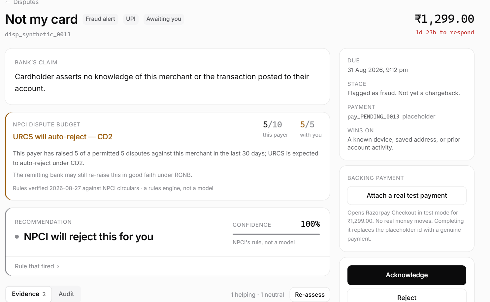
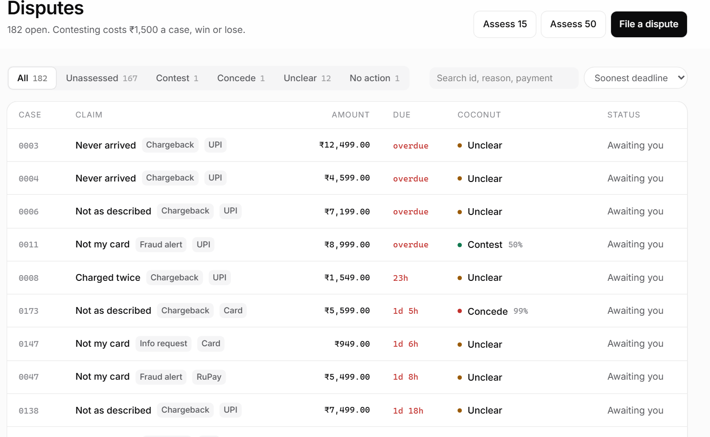
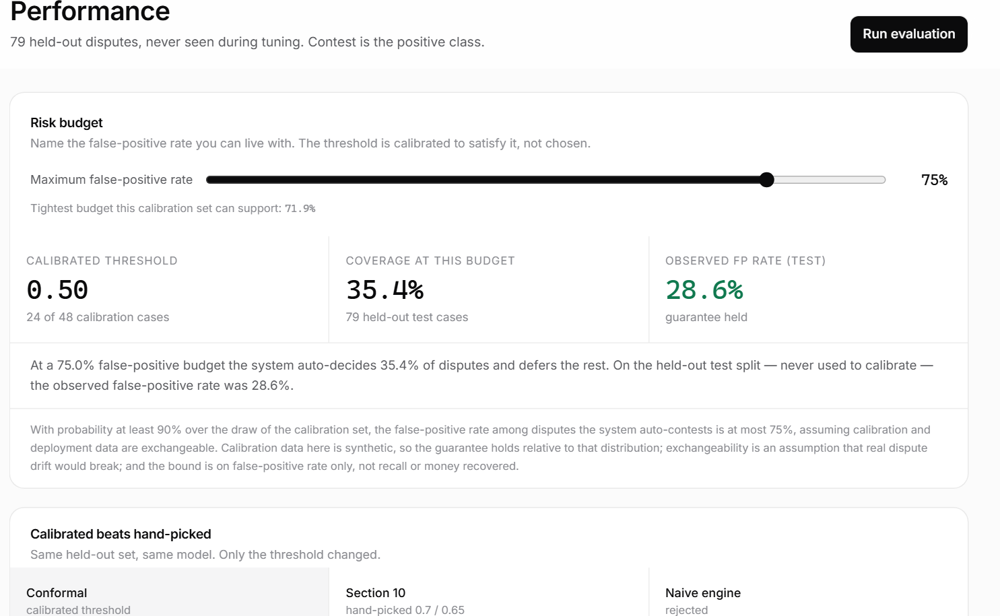

# Coconut 🥥

### Evidence-aware dispute decisions for Razorpay merchants

**Razorpay AI Buildathon · Track 2: AI Risk Manager**

**Evidence in. Defensible decision out.**

[Architecture](#architecture) · [Innovation](#why-this-is-different) ·
[Results](#results) · [Judge's route](#demo) · [Run locally](#run-locally)

> Coconut reads the bank's claim, tests every merchant record against it, and recommends
> **Contest**, **Accept**, **Human review**, or **No action** — with the exact evidence and
> rule behind the decision.

Most dispute tools help write a response. Coconut first asks the more important question:
**should this dispute be fought at all?** A weak contest can lose the sale and add
representment cost. Coconut protects the merchant from that second loss by acting only when
the evidence clears an explicit risk policy and deferring when it does not.

| What goes in | What Coconut returns | What stays with the merchant |
|---|---|---|
| Bank claim, reason code, payment rail, evidence bundle and dispute history | A recommendation, confidence, evidence-level verdicts, highlighted proof and rationale | Final approval. Coconut never submits a dispute response automatically |



## Objective — turn dispute evidence into a safe action

Dispute operations are usually a manual search across order records, delivery documents,
refund references and customer messages. The result depends on who reviews the case, how
much time remains, and whether the evidence is merely present or actually proves the point.

Coconut turns that work into one reviewable flow:

1. **Find the cases worth contesting.** It matches evidence to the specific bank claim
   instead of treating every uploaded document as useful.
2. **Avoid weak representments.** It accepts a likely loss and sends mixed evidence to a
   person instead of forcing an answer.
3. **Understand Indian payment rails.** It checks NPCI's deterministic UPI dispute caps
   before spending compute or staff time on evidence review.
4. **Show its work.** Every evidence item receives a verdict, confidence and highlighted
   sentence, and every human action is recorded.
5. **Prepare the response.** For a contestable case, it drafts an editable representment
   packet while keeping the final action under human control.

## Why this is different

| Common shortcut | Coconut's approach | Why it matters |
|---|---|---|
| “A delivery document exists” | Tests whether the document addresses this claim **and** contains reason-specific proof such as OTP, identity or address match | Document presence is not proof quality |
| One forced AI answer | A first-class **Human review** result | Uncertainty becomes an operational route, not hidden confidence |
| One model for every payment rail | Deterministic NPCI rules run before ML for eligible UPI cases | A known rule outcome should not be guessed statistically |
| An LLM decides and explains itself | Local NLI decides; an optional LLM can only improve the wording of an already-decided packet | Drafting cannot silently alter risk decisions |
| A magic confidence cutoff | The operator names a contest-error budget and Coconut selects the operating threshold from calibration data | The business risk is visible and adjustable |
| A final label with no trail | Evidence verdicts, model revision, threshold, edits, approval and the simulated Razorpay payload are retained | A reviewer can reconstruct how the result was reached |

The reusable research idea is a **selective claim-verification loop**: measure whether each
record engages the claim, measure whether it substantiates the merchant's position, combine
those signals under an explicit risk policy, and abstain when the evidence cannot carry the
decision.

### Why it fits the AI Risk Manager track

Coconut treats dispute handling as a financial-risk decision rather than a writing task.
It reduces avoidable contest cost, exposes uncertainty, gives UPI cases rail-specific
treatment, and keeps the model, policy, draft and human action as separate reviewable
stages. Razorpay integration is visible through test-mode orders, Checkout, signed webhooks
and a simulated submission payload.

<a id="architecture"></a>

## Architecture — rules first, model second, human last

Read the diagram from left to right. The orange route handles a deterministic UPI outcome.
The blue route evaluates evidence. Both end at a human-controlled action and a persisted
audit record.

```mermaid
flowchart LR
    A["Dispute<br/>claim · reason · rail · evidence"] --> B{"Eligible UPI<br/>case?"}

    B -->|Yes| C["NPCI rules engine<br/>30-day CD1 / CD2 counters"]
    C -->|Cap crossed| N["NO ACTION<br/>URCS expected to reject"]
    C -->|Merchant must answer| D
    B -->|No| D

    subgraph VERIFY["1 · Evidence verification — local NLI"]
        D["Split evidence into records"] --> E["Engagement signal<br/>Does it address the bank's claim?"]
        D --> F["Substantiation signal<br/>Does it contain reason-specific proof?"]
        E --> G["Per-record verdict<br/>support · contradict · neutral<br/>confidence · highlighted span"]
        F --> G
    end

    subgraph POLICY["2 · Explicit decision policy"]
        G --> H{"Risk threshold +<br/>corroboration rule"}
        H -->|Strong contradiction| I["ACCEPT"]
        H -->|Unanimous, strong,<br/>2+ evidence types| J["CONTEST candidate"]
        H -->|Mixed or incomplete| K["HUMAN REVIEW"]
        J -. "Synthetic demo/eval only:<br/>safety gate may demote" .-> K
    end

    J --> L["Representment draft"]
    Q["Optional Gemini / Anthropic"] -. "wording only" .-> L

    N --> M{"Human acknowledges,<br/>approves or rejects"}
    I --> M
    K --> M
    L --> M
    M --> O[("Audit log + simulated<br/>Razorpay payload")]

    classDef rules fill:#fff3d6,stroke:#b36b00,color:#5c3600
    classDef model fill:#eaf3ff,stroke:#2474c6,color:#123c66
    classDef action fill:#ecf8ef,stroke:#25834a,color:#164d2c
    class C,N rules
    class D,E,F,G,H,J model
    class I,K,L,M,O action
```



### What happens inside a decision

- **UPI forecast:** [`urcs_forecaster.py`](backend/app/services/urcs_forecaster.py) applies
  versioned rules from [`npci_rules.py`](backend/app/services/npci_rules.py). If NPCI's
  URCS is expected to reject a cap-breaching chargeback under CD1 or CD2, Coconut returns
  **No action** with the counter and rule provenance.
- **Evidence verifier:** [`verification_engine.py`](backend/app/services/verification_engine.py)
  runs `cross-encoder/nli-deberta-v3-base` locally. One signal checks engagement with the
  bank's accusation; a second checks reason-specific substantiation.
- **Decision policy:** [`decision_aggregator.py`](backend/app/services/decision_aggregator.py)
  converts evidence verdicts into a readable rule. A contest needs unanimous support,
  a sufficiently strong weakest link and at least two distinct supporting evidence types.
- **Precision guard:** [`synthetic_win_gate.py`](backend/app/services/synthetic_win_gate.py)
  can only demote synthetic contest candidates to human review. It is disabled for
  non-synthetic dispute IDs so benchmark training cannot become an undeclared production
  claim.
- **Draft and audit:** [`packet_generator.py`](backend/app/services/packet_generator.py)
  creates the response after the decision. The merchant can edit, approve, reject or
  withdraw it; the app stores what it *would* send and never calls a live submission API.

The evaluated NLI weights are pinned to Hugging Face revision
`6c749ce3425cd33b46d187e45b92bbf96ee12ec7`. Each new decision stores the full model
version and calibrated threshold, which makes later review possible.

## Four outcomes, one review surface

The isolated demo places four prepared cases in a shortcut bar. They use the normal
decision engine and differ only in their inputs.

| Demo case | What the judge should notice |
|---|---|
| **Contest** | Every record supports the merchant, the weakest link clears the threshold, independent evidence types corroborate the story, and a draft is ready |
| **Accept** | A merchant record supports the bank's claim, so paying another contest fee is hard to justify |
| **Human review** | Evidence is relevant but mixed or incomplete; Coconut states exactly which condition failed |
| **UPI limit** | The NPCI counter reaches the payer-payee cap and the rules engine returns **No action** before the NLI path |

| Dispute queue | Measured performance |
|---|---|
|  |  |

A concrete case in the seeded dataset, `disp_synthetic_0168`, shows the difference between
having evidence and having a defensible case. The cardholder claims a ₹32,499 order never
arrived. Coconut finds two independent records: delivery verified with OTP and a matching
identity document, plus a later support chat where the customer acknowledges receipt. The
case is contestable because the proof both addresses the claim and substantiates delivery.

<a id="results"></a>

## Measured results

### Frozen 1,000-case stress run

The latest run freezes the dataset, model revision, gate, thresholds, calibration inputs,
code and inference dependency versions before evaluation. Labels are stripped from every
record passed to inference.

| Metric | Result |
|---|---:|
| Cases evaluated | **1,000** |
| Contest precision | **1.000 (72/72)** |
| False contests observed | **0** |
| Descriptive Wilson 95% lower bound | **0.949** |
| Selective F1 | **0.814** |
| Selective accuracy | **0.839** |
| Automatic coverage | **0.205** |
| Sent to human review | **795/1,000** |

This result supports a narrow claim: **the automatic contest path was precise on this
synthetic stress suite.** It does not support a production accuracy claim. The 1,000 cases
are parameterized variants of 30 authored scenario families, so they are correlated rather
than 1,000 independent bank outcomes. Coverage is intentionally conservative, and the next
research target is higher coverage without losing contest precision.

The original 79-case held-out development evaluation reached 1.000 contest precision
(6/6), 0.800 F1 and 0.203 coverage. Scaling the stress check increased contest support from
6 to 72 while preserving zero observed false contests; it did not materially improve
coverage. Full caveats and the confusion matrix are produced in the local stress report.

The same 79 records also provide a direct ablation of the synthetic precision guard:

| Metric | Ungated NLI | NLI + contest guard |
|---|---:|---:|
| Contest precision | 0.714 (10/14) | **1.000 (6/6)** |
| Selective F1 | 0.741 | **0.800** |
| Selective accuracy | 0.708 | **0.813** |
| Coverage | **0.304** | 0.203 |

The guard improved the quality of the automatic contest lane by making it smaller. This is
the intended precision/coverage trade, shown as an ablation rather than presented as a
universal model improvement.

<details>
<summary><strong>How the risk-budget prototype chooses a threshold</strong></summary>

The operator supplies a maximum contest-error rate `alpha`. Coconut searches for the first
threshold whose empirical contest error plus a finite-sample Hoeffding correction fits that
budget:

```text
lambda = min { lambda : R(lambda) + sqrt(log(1/delta) / (2 n_lambda)) <= alpha }
```

`R(lambda)` is `FP / (TP + FP)` among cases Coconut would contest at that threshold. If the
calibration sample cannot support the requested budget, Coconut does not silently fall back
to a looser cutoff; it defers.

This is a development-time risk control, not a formal deployment guarantee. The score was
developed on the working set also used for calibration, and the 50-threshold search has no
family-wise multiple-testing correction. A release-grade version needs an independent
calibration period and a fixed testing procedure.

</details>

### Why optimize precision first?

The prototype assumes a configurable ₹1,500 cost to prepare and represent a dispute. A
false contest can lose the transaction **and** that operating cost. Coconut therefore
starts with a small, high-confidence automatic lane while leaving the remaining work visible
to an analyst. That is a deliberate first deployment posture, not a claim that 20.5%
coverage is the finished product.

<a id="demo"></a>

## Judge's three-minute route

1. Open **Contest** in the demo shortcut bar. Compare the bank's claim with each highlighted
   evidence span, then open **Representment** to see the draft built from those findings.
2. Open **Accept**. Notice that Coconut explains why the merchant's own record weakens the
   defense.
3. Open **Human review**. The product does not hide ambiguity behind a high confidence
   number.
4. Open **UPI limit**. Read the 30-day count, CD1/CD2 result, source date and RGNB note.
5. Open **Audit** on a decided case. The human action and simulated Razorpay payload remain
   separate from model inference.
6. Open **Performance** to inspect the risk-budget control and rerunnable evaluation.

<a id="run-locally"></a>

## Run the isolated demo

The demo uses a fresh temporary SQLite database, dummy Razorpay test credentials and the
same assessment engine as the regular app. Resetting it cannot touch the regular database.

**Prerequisites:** Python 3.12+ and Node 18+. The first assessment downloads the pinned NLI
model (about 750 MB).

```powershell
git clone https://github.com/Darsh-14/Coconut.git
Set-Location Coconut

python -m venv .venv
.\.venv\Scripts\python.exe -m pip install -r backend\requirements.txt

Set-Location frontend
npm ci
npm run build

Set-Location ..\backend
..\.venv\Scripts\python.exe -m uvicorn app.demo:app --host 127.0.0.1 --port 8011
```

Open **http://127.0.0.1:8011** and choose **Try demo**. Run this entry point with one worker.

## Run the Razorpay test-mode app

Only Razorpay **test-mode** credentials are accepted. The process refuses to start unless
`RAZORPAY_KEY_ID` begins with `rzp_test_`. Gemini and Anthropic are optional; without either,
the deterministic packet template is used.

```powershell
Set-Location Coconut
Copy-Item .env.example .env
# Add your Razorpay test key and secret to .env

.\.venv\Scripts\python.exe -m pip install -r backend\requirements.txt
Set-Location frontend
npm ci
npm run build

Set-Location ..\backend
..\.venv\Scripts\python.exe -m app.db.seed
..\.venv\Scripts\python.exe -m uvicorn app.server:site --host 127.0.0.1 --port 8000
```

Open **http://127.0.0.1:8000**. This single-origin server serves the React build and FastAPI
under one port.

For frontend development, run the services in two terminals:

```powershell
# Terminal 1
Set-Location Coconut\backend
..\.venv\Scripts\python.exe -m uvicorn app.main:app --reload --port 8000

# Terminal 2
Set-Location Coconut\frontend
npm run dev
```

Open **http://localhost:5173**. Vite proxies `/api/*` to port 8000.

<details>
<summary><strong>Docker setup</strong></summary>

```powershell
Copy-Item .env.example .env
# Add Razorpay test-mode credentials to .env
docker compose build coconut
docker compose run --rm coconut python eval/prewarm_model.py
docker compose up -d --wait --wait-timeout 900 coconut
Invoke-RestMethod http://127.0.0.1:8000/api/ready
```

The frontend and API share port 8000. SQLite data and the model cache use named volumes.
Docker Desktop could not be verified on the development machine because its engine reported
that virtualization support was unavailable; the local Python path above is verified and
does not require Docker.

</details>

## Reproduce the evaluation

From `backend/`:

```powershell
# Fast test suite; does not load the NLI model
..\.venv\Scripts\python.exe -m pytest -m "not slow" -q

# Frozen stress suite contract and fingerprints
..\.venv\Scripts\python.exe eval/evaluate_stress.py --validate-only

# Full 1,000-case model run; checkpoints every 20 cases
..\.venv\Scripts\python.exe eval/evaluate_stress.py --output-dir eval/stress_runs/full
```

Resume an interrupted full run:

```powershell
..\.venv\Scripts\python.exe eval/evaluate_stress.py --output-dir eval/stress_runs/full --resume
```

Inspect the result:

```powershell
$report = Get-Content eval/stress_runs/full/report.json -Raw | ConvertFrom-Json
$report.complete_1000
$report.metrics | Format-List
$report.families_with_false_contests
```

The runner refuses to compare results after the frozen dataset, model, thresholds,
calibration data, relevant code or inference dependencies change.

Optional end-to-end checks:

```powershell
# Run slow model and API groups separately
..\.venv\Scripts\python.exe -m pytest -m slow tests/test_verification_engine.py -q
..\.venv\Scripts\python.exe -m pytest -m slow tests/test_api.py -q

# With backend and frontend running, from frontend/
npx playwright install chromium
npm run verify:ui
```

## Razorpay integration boundary

- A case can create a real Razorpay **test-mode** order and open Checkout. After payment,
  the backend reads the payment from the order and attaches only an `authorized` or
  `captured` payment ID.
- `POST /webhooks/razorpay` verifies the signature against the raw body. With no webhook
  secret configured, every request is refused.
- Real dispute webhook events are acknowledged and logged, not converted into fake
  adjudications. Razorpay test mode cannot manufacture a real chargeback outcome.
- Approval stores the exact payload Coconut *would* submit. No route submits it to Razorpay
  or a bank.

This separation keeps the prototype honest: real test payments can demonstrate the
integration, while decision labels remain clearly identified as synthetic.

## Research path to real merchant data

The repository includes an offline pipeline for authorized historical exports:

```text
merchant export
  → remove direct identifiers with keyed HMAC
  → blind evidence annotation to final outcome
  → measure reviewer agreement and adjudicate conflicts
  → import processor outcomes
  → chronological, group-disjoint train/calibration/test splits
  → calibrated baseline and untouched final report
```

Only disputes that were actually contested and later resolved as won or lost enter the
binary outcome baseline. Private rows, splits and artifacts are ignored by Git. No real
merchant records ship with this repository, so the current metrics remain synthetic.

## Repository map

```text
backend/
├── app/services/       NLI verification, decision policy, UPI rules, packets
├── app/api/            dispute, approval, evaluation and webhook routes
├── app/demo.py         isolated resettable demo entry point
├── data/               seeded synthetic data and private-data tooling
├── eval/               held-out evaluation, calibration and frozen stress suite
└── tests/              API, model-policy, data, webhook and concurrency checks

frontend/
├── src/pages/          landing, home, queue, case and performance views
├── src/components/     evidence map, audit trail, risk budget and demo controls
└── scripts/            Playwright smoke, accessibility and screenshot checks
```

## Technology

| Layer | Choice |
|---|---|
| Decision model | Pinned DeBERTa-v3 NLI cross-encoder, local CPU inference |
| Safety policy | Explicit Python aggregation + development-time risk calibration |
| UPI intelligence | Versioned deterministic NPCI rule engine |
| API and storage | FastAPI, SQLAlchemy, SQLite |
| Interface | React 19, TypeScript, Vite, Tailwind CSS |
| Optional drafting | Gemini or Anthropic, isolated after the decision boundary |
| Verification | Pytest and Playwright |

## Limits and next research milestone

- The supplied disputes and outcome labels are synthetic. They measure agreement with
  authored labels, not bank adjudication accuracy.
- The synthetic-only safety gate is trained on the working set and cannot be used as a
  production claim.
- The 1,000-case suite has 30 correlated scenario families. Its Wilson interval is
  descriptive only.
- Automatic coverage is 20.5%; most cases still need a person. Retrieval-phase claims are
  a known weak area because a request for documents is linguistically different from an
  accusation.
- The app has no server-side authentication and is intended for a local, single-merchant
  demonstration with test payments.
- NPCI rules change. The source names and last-verified date are visible in code and UI and
  must be rechecked before real use.

The next milestone is a reason-specific selective classifier trained on authorized,
adjudicated merchant outcomes, with separate **Contest** and **Accept** thresholds. The goal
is at least 60% automatic coverage while maintaining a minimum contest precision chosen by
the merchant and measuring accept correctness separately on a new untouched test period.

---

**Coconut does not try to automate judgment away. It makes the safe decision obvious, the
uncertain decision visible, and every action reviewable.**
